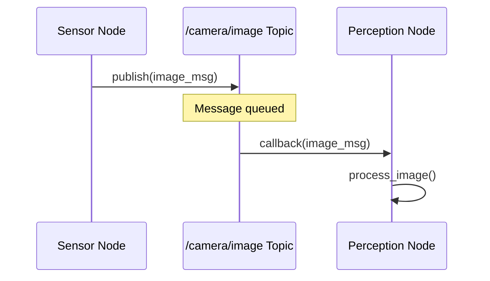

# Topic 1: ROS 2 Architecture - The Robotic Nervous System

## Learning Objectives

By the end of this topic, you will be able to:

1. Explain how ROS 2 serves as the "nervous system" of a humanoid robot
2. Describe the publish-subscribe communication pattern using biological analogies
3. Identify the roles of Nodes, Topics, and Services in robotic systems
4. Visualize ROS 2 architecture using node graphs

## Conceptual Foundation

### The Nervous System Analogy

Just as the human nervous system enables communication between the brain and body, **ROS 2 (Robot Operating System 2)** serves as the communication backbone for humanoid robots. This middleware connects:

- **Sensors** (the robot's sensory organs) to **processing nodes** (the brain)
- **Decision-making algorithms** to **actuators** (muscles and joints)
- **Multiple subsystems** that must coordinate in real-time

:::info Key Insight
ROS 2 doesn't control the robot directly—it provides the **communication infrastructure** that allows different software components to work together, just like neurons enable different brain regions to coordinate.
:::

### Core Communication Patterns

ROS 2 implements several communication patterns, each suited for different robotics scenarios:

| Pattern | Biological Analogy | Use Case |
|---------|-------------------|----------|
| **Topics** (Pub/Sub) | Sensory nerves broadcasting signals | Continuous data streams (sensor data) |
| **Services** (Request/Reply) | Reflex arcs | One-time queries (get status) |
| **Actions** (Long-running) | Motor commands with feedback | Complex movements (walk to position) |

## Architecture Diagram

```mermaid
graph TB
    subgraph Sensors["Sensory Input (Afferent)"]
        CAM[Camera Node]
        LIDAR[LiDAR Node]
        IMU[IMU Node]
    end

    subgraph Processing["Central Processing (Brain)"]
        PERCEPT[Perception Node]
        PLAN[Planning Node]
        CTRL[Controller Node]
    end

    subgraph Actuators["Motor Output (Efferent)"]
        JOINT[Joint Controller]
        GRIP[Gripper Controller]
    end

    CAM -->|/camera/image| PERCEPT
    LIDAR -->|/scan| PERCEPT
    IMU -->|/imu/data| CTRL

    PERCEPT -->|/detected_objects| PLAN
    PLAN -->|/trajectory| CTRL
    CTRL -->|/joint_commands| JOINT
    CTRL -->|/gripper_cmd| GRIP

    style Sensors fill:#1a365d,stroke:#00d4ff
    style Processing fill:#1e3a5f,stroke:#00d4ff
    style Actuators fill:#1a365d,stroke:#00d4ff
```



## Guided Implementation

### Understanding Nodes

A **Node** is the fundamental unit of computation in ROS 2. Each node is responsible for a single, modular purpose:

```python
import rclpy
from rclpy.node import Node


class SensorNode(Node):
    """
    A basic ROS 2 node demonstrating the nervous system analogy.

    This node acts like a sensory neuron, publishing data at regular intervals.
    """

    def __init__(self):
        super().__init__('sensor_node')

        # Create a publisher (like an axon terminal releasing neurotransmitters)
        self.publisher = self.create_publisher(
            String,          # Message type
            '/sensor/data',  # Topic name (like a neural pathway)
            10               # Queue size (buffer capacity)
        )

        # Timer for periodic publishing (like neural firing rate)
        self.timer = self.create_timer(0.1, self.publish_data)  # 10 Hz

        self.get_logger().info('Sensor node initialized - neural pathway established')

    def publish_data(self):
        """Publish sensor data like a neuron firing."""
        msg = String()
        msg.data = f'Sensor reading at {self.get_clock().now()}'
        self.publisher.publish(msg)


def main(args=None):
    rclpy.init(args=args)
    node = SensorNode()
    rclpy.spin(node)
    node.destroy_node()
    rclpy.shutdown()


if __name__ == '__main__':
    main()
```

### Understanding Topics

**Topics** are named buses over which nodes exchange messages—think of them as dedicated neural pathways:



## Simulation Exercise

:::tip Hands-On Exercise
Launch the following commands to visualize a live ROS 2 node graph:

```bash
# Terminal 1: Start the demo nodes
ros2 run demo_nodes_cpp talker

# Terminal 2: Start the listener
ros2 run demo_nodes_cpp listener

# Terminal 3: Visualize the graph
ros2 run rqt_graph rqt_graph
```

Observe how the nodes connect through topics, just like neurons forming synapses.
:::

{/* T037: Chatbot integration placeholder
TODO: Future AI Assistant integration point
- Context-aware Q&A about ROS 2 architecture
- Code explanation assistance
- Concept clarification chat interface
*/}

## Reflection Questions

1. **Analogy Exploration**: How does the publish-subscribe pattern in ROS 2 differ from how neurons communicate? What are the limitations of this analogy?

2. **Design Thinking**: If you were designing a humanoid robot's perception system, how would you organize the nodes and topics to minimize latency?

3. **Real-World Application**: Why do you think ROS 2 chose a decentralized architecture (no central broker) for safety-critical robotics applications?

## Further Reading

- [ROS 2 Documentation: Nodes](https://docs.ros.org/en/humble/Concepts/Basic/About-Nodes.html)
- [ROS 2 Documentation: Topics](https://docs.ros.org/en/humble/Concepts/Basic/About-Topics.html)
- [Understanding ROS 2 DDS](https://docs.ros.org/en/humble/Concepts/Intermediate/About-Different-Middleware-Vendors.html)

---

**Next Topic**: [Python Agents with rclpy](./python-agents) - Build intelligent agents that bridge AI models with ROS 2 controllers.
