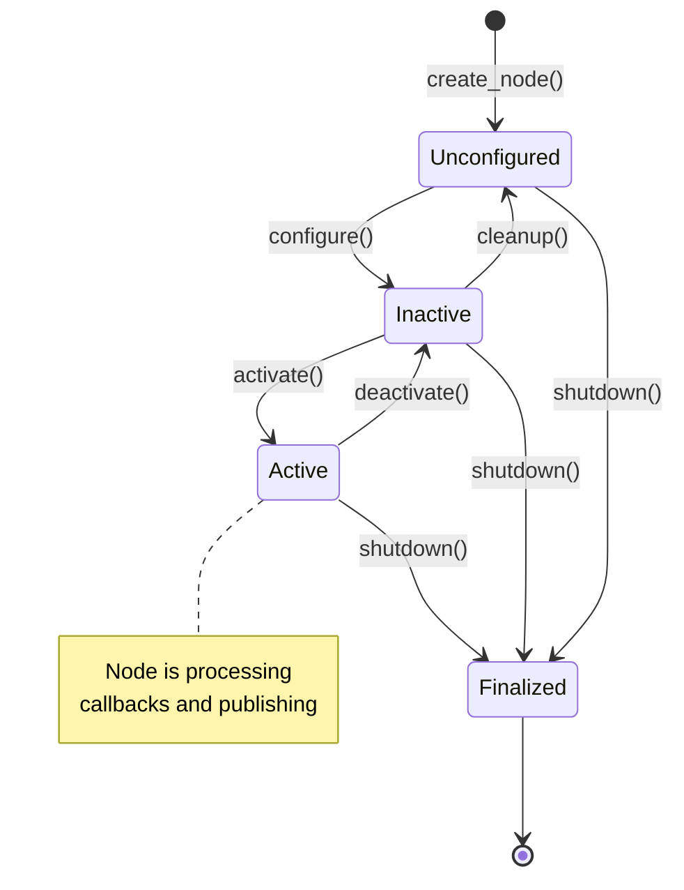

# Topic 2: Python Agents with rclpy

## Learning Objectives

By the end of this topic, you will be able to:

1. Create ROS 2 nodes using Python and the rclpy client library
2. Implement the publisher-subscriber pattern for sensor data processing
3. Build service clients for synchronous robot commands
4. Understand how Python agents bridge AI models with low-level controllers

## Conceptual Foundation

### The Agent as Neural Bridge

In the nervous system analogy, **Python agents** serve as the higher-level cognitive processes—they interpret sensory data, make decisions, and issue commands. The `rclpy` library provides the Python bindings to ROS 2, enabling:

- **Rapid prototyping** of robotic behaviors
- **Integration with AI/ML frameworks** (PyTorch, TensorFlow)
- **High-level decision making** that coordinates low-level C++ controllers

:::info Why Python for Robotics?
While C++ dominates real-time control loops, Python excels at:
- AI model inference
- Complex behavior trees
- Rapid iteration during development
- Integration with data science tools
:::

### The rclpy Architecture

```mermaid
flowchart LR
    subgraph Python["Python Layer (rclpy)"]
        AGENT[AI Agent]
        PUB[Publisher]
        SUB[Subscriber]
        SRV[Service Client]
    end

    subgraph ROS2["ROS 2 Middleware (rcl)"]
        DDS[DDS Layer]
    end

    subgraph CPP["C++ Controllers"]
        CTRL[Motion Controller]
        HW[Hardware Interface]
    end

    AGENT --> PUB
    AGENT --> SUB
    AGENT --> SRV

    PUB --> DDS
    SUB --> DDS
    SRV --> DDS

    DDS --> CTRL
    CTRL --> HW

    style Python fill:#1a365d,stroke:#00d4ff
    style ROS2 fill:#1e3a5f,stroke:#00d4ff
    style CPP fill:#1a365d,stroke:#00d4ff
```



## Guided Implementation

### Creating a Basic ROS 2 Node

Every rclpy node follows a consistent structure. Here's a class-based node that subscribes to sensor data and publishes commands:

```python
#!/usr/bin/env python3
"""
Perception Agent Node

This node demonstrates the bridge between perception and action,
subscribing to camera data and publishing movement commands.
"""

import rclpy
from rclpy.node import Node
from rclpy.qos import QoSProfile, ReliabilityPolicy

from sensor_msgs.msg import Image
from geometry_msgs.msg import Twist
from cv_bridge import CvBridge


class PerceptionAgent(Node):
    """
    A perception agent that processes visual input and generates motion commands.

    This class demonstrates the agent pattern in ROS 2:
    - Subscribes to sensor data (perception)
    - Processes information (cognition)
    - Publishes commands (action)
    """

    def __init__(self):
        super().__init__('perception_agent')

        # QoS profile for sensor data (best effort for real-time)
        sensor_qos = QoSProfile(
            depth=10,
            reliability=ReliabilityPolicy.BEST_EFFORT
        )

        # Subscriber: Sensory input
        self.image_sub = self.create_subscription(
            Image,
            '/camera/image_raw',
            self.image_callback,
            sensor_qos
        )

        # Publisher: Motor commands
        self.cmd_pub = self.create_publisher(
            Twist,
            '/cmd_vel',
            10
        )

        # OpenCV bridge for image processing
        self.bridge = CvBridge()

        self.get_logger().info('Perception Agent initialized')

    def image_callback(self, msg: Image):
        """
        Process incoming camera images.

        This callback acts like the visual cortex, transforming
        raw sensor data into actionable information.
        """
        try:
            # Convert ROS Image to OpenCV format
            cv_image = self.bridge.imgmsg_to_cv2(msg, 'bgr8')

            # TODO: Add AI model inference here
            # detection_result = self.model.predict(cv_image)

            # Generate movement command based on perception
            cmd = self.compute_velocity(cv_image)
            self.cmd_pub.publish(cmd)

        except Exception as e:
            self.get_logger().error(f'Image processing failed: {e}')

    def compute_velocity(self, image) -> Twist:
        """
        Compute velocity command from visual input.

        In a full implementation, this would use AI inference
        to determine appropriate robot motion.
        """
        cmd = Twist()
        # Placeholder: Add your control logic
        cmd.linear.x = 0.0
        cmd.angular.z = 0.0
        return cmd


def main(args=None):
    rclpy.init(args=args)

    agent = PerceptionAgent()

    try:
        rclpy.spin(agent)
    except KeyboardInterrupt:
        pass
    finally:
        agent.destroy_node()
        rclpy.shutdown()


if __name__ == '__main__':
    main()
```

### Service Clients for Synchronous Operations

Sometimes you need synchronous request-response communication, like querying robot state:

```python
from example_interfaces.srv import AddTwoInts


class ServiceClientNode(Node):
    """Demonstrates synchronous service calls in ROS 2."""

    def __init__(self):
        super().__init__('service_client')

        self.client = self.create_client(
            AddTwoInts,
            '/robot/get_joint_state'
        )

        # Wait for service to become available
        while not self.client.wait_for_service(timeout_sec=1.0):
            self.get_logger().info('Waiting for service...')

    def send_request(self, a: int, b: int):
        """Send a synchronous service request."""
        request = AddTwoInts.Request()
        request.a = a
        request.b = b

        future = self.client.call_async(request)
        rclpy.spin_until_future_complete(self, future)

        return future.result()
```

## Node Lifecycle Diagram



## Simulation Exercise

:::tip Hands-On Exercise
Create a simple "echo" agent that subscribes to one topic and republishes to another:

```bash
# Create a new package
cd ~/ros2_ws/src
ros2 pkg create --build-type ament_python my_agent

# Edit the node file, then build
colcon build --packages-select my_agent
source install/setup.bash

# Run your agent
ros2 run my_agent echo_agent
```
:::

## Reflection Questions

1. **Architecture Decision**: When should you use Python (rclpy) vs C++ (rclcpp) for a robotics node? Consider latency, development speed, and AI integration.

2. **Real-Time Constraints**: How does the Python Global Interpreter Lock (GIL) affect ROS 2 node performance? What strategies can mitigate this?

3. **Design Pattern**: The agent pattern separates perception, cognition, and action. How would you modify this pattern for a multi-robot system?

## Further Reading

- [rclpy API Documentation](https://docs.ros.org/en/humble/p/rclpy/)
- [Writing a Simple Publisher and Subscriber (Python)](https://docs.ros.org/en/humble/Tutorials/Beginner-Client-Libraries/Writing-A-Simple-Py-Publisher-And-Subscriber.html)
- [ROS 2 Managed Nodes (Lifecycle)](https://docs.ros.org/en/humble/Concepts/Intermediate/About-Lifecycle-Nodes.html)

---

**Next Topic**: [Body Definition with URDF](./body-definition) - Define your robot's physical structure for simulation and control.
