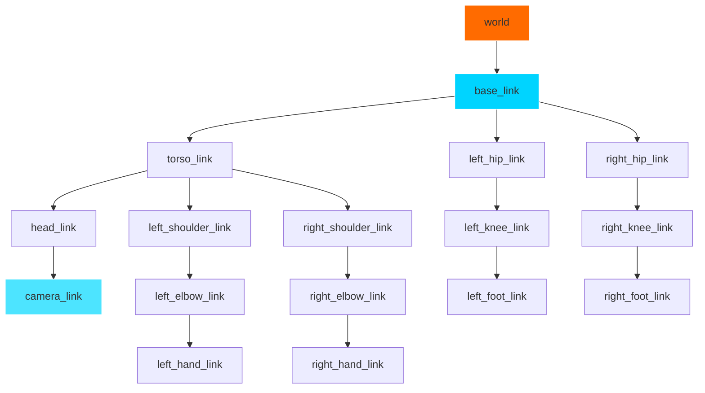

# Topic 3: Body Definition with URDF

## Learning Objectives

By the end of this topic, you will be able to:

1. Understand URDF (Unified Robot Description Format) as the robot's "skeleton"
2. Define links and joints that model humanoid robot morphology
3. Visualize the TF (Transform) tree that tracks spatial relationships
4. Create a basic humanoid robot description for simulation

## Conceptual Foundation

### The Robot's Body Schema

Just as humans have an internal "body schema" that tracks limb positions, robots need a formal description of their physical structure. **URDF** provides this description, defining:

- **Links**: Rigid body segments (like bones)
- **Joints**: Connections between links (like joints and muscles)
- **Visual geometry**: How the robot appears
- **Collision geometry**: Physical boundaries for contact

:::info Key Insight
URDF is to a robot what DNA is to an organism—it defines the structural blueprint that determines what movements are possible.
:::

### The Transform Tree (TF)

The **TF tree** is a runtime representation of spatial relationships between all robot parts. It answers questions like:
- "Where is the hand relative to the torso?"
- "What is the camera's position in the world frame?"



## Architecture Diagram

```mermaid
flowchart TB
    subgraph Description["Robot Description"]
        URDF[URDF File]
        XACRO[Xacro Macros]
    end

    subgraph Runtime["ROS 2 Runtime"]
        RSP[robot_state_publisher]
        JSP[joint_state_publisher]
        TF[TF2 Tree]
    end

    subgraph Consumers["Data Consumers"]
        RVIZ[RViz Visualization]
        NAV[Navigation Stack]
        MANIP[Manipulation Planning]
    end

    XACRO --> URDF
    URDF --> RSP
    JSP --> RSP
    RSP --> TF

    TF --> RVIZ
    TF --> NAV
    TF --> MANIP

    style Description fill:#1a365d,stroke:#00d4ff
    style Runtime fill:#1e3a5f,stroke:#00d4ff
    style Consumers fill:#1a365d,stroke:#00d4ff
```



## Guided Implementation

### Basic URDF Structure

A minimal humanoid torso definition:

```xml
<?xml version="1.0"?>
<robot name="humanoid_torso" xmlns:xacro="http://www.ros.org/wiki/xacro">

  <!-- Base link (pelvis) - the root of our humanoid -->
  <link name="base_link">
    <visual>
      <geometry>
        <box size="0.3 0.2 0.15"/>
      </geometry>
      <material name="gray">
        <color rgba="0.5 0.5 0.5 1.0"/>
      </material>
    </visual>
    <collision>
      <geometry>
        <box size="0.3 0.2 0.15"/>
      </geometry>
    </collision>
    <inertial>
      <mass value="5.0"/>
      <inertia ixx="0.1" ixy="0" ixz="0" iyy="0.1" iyz="0" izz="0.1"/>
    </inertial>
  </link>

  <!-- Torso link -->
  <link name="torso_link">
    <visual>
      <geometry>
        <box size="0.35 0.25 0.5"/>
      </geometry>
      <material name="blue">
        <color rgba="0.2 0.4 0.8 1.0"/>
      </material>
    </visual>
    <collision>
      <geometry>
        <box size="0.35 0.25 0.5"/>
      </geometry>
    </collision>
    <inertial>
      <mass value="10.0"/>
      <inertia ixx="0.5" ixy="0" ixz="0" iyy="0.5" iyz="0" izz="0.2"/>
    </inertial>
  </link>

  <!-- Spine joint connecting base to torso -->
  <joint name="spine_joint" type="revolute">
    <parent link="base_link"/>
    <child link="torso_link"/>
    <origin xyz="0 0 0.325" rpy="0 0 0"/>
    <axis xyz="0 0 1"/>
    <limit lower="-0.5" upper="0.5" effort="100" velocity="1.0"/>
  </joint>

  <!-- Head link -->
  <link name="head_link">
    <visual>
      <geometry>
        <sphere radius="0.12"/>
      </geometry>
      <material name="skin">
        <color rgba="0.9 0.75 0.65 1.0"/>
      </material>
    </visual>
    <collision>
      <geometry>
        <sphere radius="0.12"/>
      </geometry>
    </collision>
    <inertial>
      <mass value="3.0"/>
      <inertia ixx="0.02" ixy="0" ixz="0" iyy="0.02" iyz="0" izz="0.02"/>
    </inertial>
  </link>

  <!-- Neck joint -->
  <joint name="neck_joint" type="revolute">
    <parent link="torso_link"/>
    <child link="head_link"/>
    <origin xyz="0 0 0.35" rpy="0 0 0"/>
    <axis xyz="0 1 0"/>
    <limit lower="-0.8" upper="0.8" effort="50" velocity="2.0"/>
  </joint>

</robot>
```

### Using Xacro for Reusable Components

Xacro (XML Macros) allows parameterized, reusable URDF components:

```xml
<?xml version="1.0"?>
<robot xmlns:xacro="http://www.ros.org/wiki/xacro" name="humanoid_arm">

  <!-- Arm macro - reusable for left and right -->
  <xacro:macro name="arm" params="side parent reflect">

    <link name="${side}_shoulder_link">
      <visual>
        <geometry>
          <sphere radius="0.05"/>
        </geometry>
      </visual>
      <inertial>
        <mass value="1.0"/>
        <inertia ixx="0.01" ixy="0" ixz="0" iyy="0.01" iyz="0" izz="0.01"/>
      </inertial>
    </link>

    <joint name="${side}_shoulder_joint" type="revolute">
      <parent link="${parent}"/>
      <child link="${side}_shoulder_link"/>
      <origin xyz="${reflect * 0.2} 0 0.2" rpy="0 0 0"/>
      <axis xyz="1 0 0"/>
      <limit lower="-3.14" upper="3.14" effort="100" velocity="2.0"/>
    </joint>

    <link name="${side}_upper_arm_link">
      <visual>
        <geometry>
          <cylinder radius="0.04" length="0.3"/>
        </geometry>
        <origin xyz="0 0 -0.15" rpy="0 0 0"/>
      </visual>
      <inertial>
        <mass value="2.0"/>
        <inertia ixx="0.02" ixy="0" ixz="0" iyy="0.02" iyz="0" izz="0.01"/>
      </inertial>
    </link>

    <joint name="${side}_shoulder_pitch" type="revolute">
      <parent link="${side}_shoulder_link"/>
      <child link="${side}_upper_arm_link"/>
      <origin xyz="0 0 0" rpy="0 0 0"/>
      <axis xyz="0 1 0"/>
      <limit lower="-2.0" upper="2.0" effort="100" velocity="2.0"/>
    </joint>

  </xacro:macro>

  <!-- Instantiate left and right arms -->
  <xacro:arm side="left" parent="torso_link" reflect="1"/>
  <xacro:arm side="right" parent="torso_link" reflect="-1"/>

</robot>
```

### Launch File for Visualization

```python
from launch import LaunchDescription
from launch_ros.actions import Node
from launch.substitutions import Command
from ament_index_python.packages import get_package_share_directory
import os


def generate_launch_description():
    """Launch robot visualization in RViz."""

    pkg_path = get_package_share_directory('my_humanoid')
    urdf_path = os.path.join(pkg_path, 'urdf', 'humanoid.urdf.xacro')

    robot_description = Command(['xacro ', urdf_path])

    return LaunchDescription([
        # Publish robot description to /robot_description
        Node(
            package='robot_state_publisher',
            executable='robot_state_publisher',
            parameters=[{'robot_description': robot_description}],
        ),

        # GUI for joint control
        Node(
            package='joint_state_publisher_gui',
            executable='joint_state_publisher_gui',
        ),

        # RViz visualization
        Node(
            package='rviz2',
            executable='rviz2',
            arguments=['-d', os.path.join(pkg_path, 'rviz', 'view_robot.rviz')],
        ),
    ])
```

## Simulation Exercise

:::tip Hands-On Exercise
Build and visualize the humanoid URDF:

```bash
# Create package structure
ros2 pkg create --build-type ament_cmake my_humanoid
mkdir -p my_humanoid/urdf my_humanoid/launch my_humanoid/rviz

# Add URDF file and launch file, then build
colcon build --packages-select my_humanoid

# Launch visualization
ros2 launch my_humanoid view_robot.launch.py
```

Use the joint_state_publisher_gui to move joints and observe the TF tree update.
:::

## Reflection Questions

1. **Design Trade-off**: Why do we separate visual and collision geometry? When might you use simplified collision meshes?

2. **Coordinate Frames**: How does the choice of base_link position affect navigation and manipulation planning?

3. **Real Robot**: What additional URDF elements would you need for a real humanoid robot with force-torque sensors?

## Further Reading

- [URDF Specification](http://wiki.ros.org/urdf/XML)
- [Xacro Documentation](http://wiki.ros.org/xacro)
- [TF2 Documentation](https://docs.ros.org/en/humble/Concepts/Intermediate/About-Tf2.html)
- [robot_state_publisher](https://docs.ros.org/en/humble/p/robot_state_publisher/)

---

**Next**: [Module 1 Assessment](./assessment) - Apply your knowledge by building a complete ROS 2 package.
