# Topic 1: Physics Simulation with Gazebo

## Learning Objectives

By the end of this topic, you will be able to:

1. Explain the role of physics simulation in humanoid robot development
2. Understand Gazebo's physics engine architecture (gravity, collisions, friction)
3. Configure simulation parameters for realistic humanoid behavior
4. Identify the differences between Gazebo Classic and Gazebo Sim (Harmonic)

## Conceptual Foundation

### Why Simulate?

Physical humanoid robots are expensive, fragile, and potentially dangerous during development. **Digital twins**—virtual replicas of physical robots—allow us to:

- **Test dangerous behaviors** (falling, collisions) without hardware damage
- **Iterate rapidly** on control algorithms before deployment
- **Generate training data** for AI/ML models
- **Validate designs** before manufacturing

:::info Key Insight
A well-tuned simulation is like a "practice arena" where your robot can fail thousands of times safely, learning behaviors that would destroy physical hardware.
:::

### The Physics Pipeline

```mermaid
flowchart LR
    subgraph Input["Simulation Input"]
        URDF[Robot URDF]
        WORLD[World SDF]
        CTRL[Controller Commands]
    end

    subgraph Engine["Physics Engine"]
        DYNAMICS[Rigid Body Dynamics]
        COLLISION[Collision Detection]
        CONTACT[Contact Resolution]
    end

    subgraph Output["Simulation Output"]
        STATE[Joint States]
        SENSOR[Sensor Data]
        VIS[Visualization]
    end

    URDF --> DYNAMICS
    WORLD --> COLLISION
    CTRL --> DYNAMICS

    DYNAMICS --> STATE
    COLLISION --> CONTACT
    CONTACT --> DYNAMICS
    DYNAMICS --> SENSOR
    DYNAMICS --> VIS

    style Input fill:#1a365d,stroke:#00d4ff
    style Engine fill:#1e3a5f,stroke:#ff6b00
    style Output fill:#1a365d,stroke:#00d4ff
```



### Gazebo Evolution

| Version | Name | Status | Key Features |
|---------|------|--------|--------------|
| Gazebo 1-11 | Gazebo Classic | Legacy | ODE physics, SDF worlds |
| Gazebo Fortress | Ignition Gazebo | LTS | Plugin architecture, multiple physics engines |
| **Gazebo Harmonic** | Gazebo Sim | **Current LTS** | ROS 2 integration, improved sensors |

:::warning Hardware Requirements
Running Gazebo Sim with complex humanoid models requires:
- **Minimum**: 8GB RAM, 4-core CPU, integrated graphics
- **Recommended**: 16GB+ RAM, dedicated GPU (for sensor simulation)
- **For Isaac Sim integration**: NVIDIA RTX 4070 Ti or better
:::

## Architecture Diagram

```mermaid
flowchart TB
    subgraph ROS2["ROS 2 Layer"]
        CTRL_NODE[Controller Node]
        STATE_PUB[State Publisher]
    end

    subgraph Bridge["ros_gz_bridge"]
        TOPIC_BRIDGE[Topic Bridge]
        SERVICE_BRIDGE[Service Bridge]
    end

    subgraph Gazebo["Gazebo Sim"]
        PHYSICS[Physics Plugin]
        SENSORS[Sensor Systems]
        RENDERING[Rendering Engine]
        WORLD_STATE[World State]
    end

    CTRL_NODE <-->|/joint_commands| TOPIC_BRIDGE
    STATE_PUB <-->|/joint_states| TOPIC_BRIDGE
    TOPIC_BRIDGE <--> PHYSICS
    TOPIC_BRIDGE <--> SENSORS

    PHYSICS --> WORLD_STATE
    WORLD_STATE --> SENSORS
    WORLD_STATE --> RENDERING

    style ROS2 fill:#1a365d,stroke:#00d4ff
    style Bridge fill:#ff6b00,stroke:#fff
    style Gazebo fill:#1e3a5f,stroke:#00d4ff
```



## Guided Implementation

### Installing Gazebo Harmonic

```bash
# Add Gazebo repository (Ubuntu 22.04)
sudo wget https://packages.osrfoundation.org/gazebo.gpg \
    -O /usr/share/keyrings/pkgs-osrf-archive-keyring.gpg
echo "deb [arch=$(dpkg --print-architecture) signed-by=/usr/share/keyrings/pkgs-osrf-archive-keyring.gpg] \
    http://packages.osrfoundation.org/gazebo/ubuntu-stable $(lsb_release -cs) main" | \
    sudo tee /etc/apt/sources.list.d/gazebo-stable.list > /dev/null

# Install Gazebo Harmonic
sudo apt update
sudo apt install gz-harmonic

# Install ROS 2 - Gazebo bridge
sudo apt install ros-humble-ros-gz
```

### Creating a World File (SDF)

```xml
<?xml version="1.0"?>
<sdf version="1.9">
  <world name="humanoid_test_world">

    <!-- Physics configuration -->
    <physics name="default_physics" type="dart">
      <max_step_size>0.001</max_step_size>
      <real_time_factor>1.0</real_time_factor>
      <real_time_update_rate>1000</real_time_update_rate>
      <dart>
        <collision_detector>bullet</collision_detector>
      </dart>
    </physics>

    <!-- Gravity (Earth standard) -->
    <gravity>0 0 -9.81</gravity>

    <!-- Lighting -->
    <light type="directional" name="sun">
      <cast_shadows>true</cast_shadows>
      <pose>0 0 10 0 0 0</pose>
      <diffuse>0.8 0.8 0.8 1</diffuse>
      <specular>0.2 0.2 0.2 1</specular>
      <direction>-0.5 0.1 -0.9</direction>
    </light>

    <!-- Ground plane -->
    <model name="ground_plane">
      <static>true</static>
      <link name="link">
        <collision name="collision">
          <geometry>
            <plane>
              <normal>0 0 1</normal>
              <size>100 100</size>
            </plane>
          </geometry>
          <surface>
            <friction>
              <ode>
                <mu>0.8</mu>
                <mu2>0.8</mu2>
              </ode>
            </friction>
          </surface>
        </collision>
        <visual name="visual">
          <geometry>
            <plane>
              <normal>0 0 1</normal>
              <size>100 100</size>
            </plane>
          </geometry>
          <material>
            <ambient>0.3 0.3 0.3 1</ambient>
          </material>
        </visual>
      </link>
    </model>

    <!-- Include humanoid robot -->
    <include>
      <uri>model://humanoid</uri>
      <pose>0 0 1.0 0 0 0</pose>
    </include>

  </world>
</sdf>
```

### Physics Parameters Explained

| Parameter | Humanoid Recommendation | Effect |
|-----------|------------------------|--------|
| `max_step_size` | 0.001s (1ms) | Smaller = more accurate, slower |
| `real_time_factor` | 1.0 | 1.0 = real-time, &lt;1 = slower than real |
| `friction (mu)` | 0.6-1.0 | Higher = more grip for walking |
| `contact_stiffness` | 1e6-1e8 | Higher = harder contact, can cause instability |

### Launch File Integration

```python
from launch import LaunchDescription
from launch.actions import IncludeLaunchDescription, ExecuteProcess
from launch.launch_description_sources import PythonLaunchDescriptionSource
from launch_ros.actions import Node
from ament_index_python.packages import get_package_share_directory
import os


def generate_launch_description():
    """Launch Gazebo with humanoid robot and ROS 2 bridge."""

    pkg_path = get_package_share_directory('humanoid_sim')
    world_path = os.path.join(pkg_path, 'worlds', 'test_world.sdf')

    return LaunchDescription([
        # Start Gazebo with the world
        ExecuteProcess(
            cmd=['gz', 'sim', '-r', world_path],
            output='screen'
        ),

        # Bridge ROS 2 topics to Gazebo
        Node(
            package='ros_gz_bridge',
            executable='parameter_bridge',
            arguments=[
                '/joint_states@sensor_msgs/msg/JointState@gz.msgs.Model',
                '/cmd_vel@geometry_msgs/msg/Twist@gz.msgs.Twist',
            ],
            output='screen'
        ),
    ])
```

## Simulation Exercise

:::tip Hands-On Exercise
Launch a basic Gazebo simulation and observe physics behavior:

```bash
# Start Gazebo with an empty world
gz sim shapes.sdf

# In the GUI:
# 1. Add a sphere (Insert > Shapes > Sphere)
# 2. Position it above ground
# 3. Press Play to see gravity in action
# 4. Adjust friction and observe rolling behavior
```
:::

## Reflection Questions

1. **Physics Trade-offs**: Why might you choose a smaller physics timestep for humanoid simulation compared to wheeled robots?

2. **Simulation Fidelity**: What physical phenomena are difficult to simulate accurately? How might this affect sim-to-real transfer?

3. **Performance Optimization**: If your simulation runs slower than real-time, what parameters would you adjust first?

## Further Reading

- [Gazebo Sim Documentation](https://gazebosim.org/docs/harmonic)
- [SDF Specification](http://sdformat.org/spec)
- [ros_gz Integration](https://github.com/gazebosim/ros_gz)
- [Physics Engine Comparison](https://gazebosim.org/docs/harmonic/physics_engines)

---

**Next Topic**: [High-Fidelity Rendering with Unity](./high-fidelity-rendering) - Create photorealistic simulations for human-robot interaction research.
