# Topic 2: High-Fidelity Rendering with Unity

## Learning Objectives

By the end of this topic, you will be able to:

1. Understand when high-fidelity rendering is necessary vs. simple physics simulation
2. Explain Unity's role in robotics simulation alongside Gazebo
3. Identify NVIDIA Isaac Sim as the bridge between rendering and robotics
4. Configure Unity-based simulation for vision AI training

## Conceptual Foundation

### Beyond Physics: Why Rendering Matters

While Gazebo excels at physics simulation, many robotics applications require **photorealistic visuals**:

- **Computer Vision Training**: AI models need diverse, realistic images
- **Human-Robot Interaction**: Studying how humans respond to robot appearance
- **Marketing & Stakeholder Demos**: Communicating robot capabilities
- **Depth Sensor Simulation**: LiDAR and RGB-D cameras need accurate light modeling

:::info Key Insight
A robot's "brain" (AI model) often learns from images. If training images don't match real-world lighting, textures, and noise, the model may fail on actual hardware—this is the **sim-to-real gap**.
:::

### The Rendering Stack

```mermaid
flowchart TB
    subgraph LoFi["Low-Fidelity (Fast)"]
        GAZEBO[Gazebo OGRE]
        SIMPLE[Simple Meshes]
    end

    subgraph HiFi["High-Fidelity (Realistic)"]
        UNITY[Unity HDRP]
        ISAAC[Isaac Sim RTX]
        PBR[PBR Materials]
        GI[Global Illumination]
    end

    subgraph Output["Training Data"]
        RGB[RGB Images]
        DEPTH[Depth Maps]
        SEG[Segmentation]
        NORMAL[Normal Maps]
    end

    GAZEBO --> RGB
    SIMPLE --> GAZEBO

    UNITY --> RGB
    UNITY --> DEPTH
    ISAAC --> RGB
    ISAAC --> DEPTH
    ISAAC --> SEG
    ISAAC --> NORMAL

    PBR --> UNITY
    PBR --> ISAAC
    GI --> UNITY
    GI --> ISAAC

    style LoFi fill:#1a365d,stroke:#00d4ff
    style HiFi fill:#1e3a5f,stroke:#ff6b00
    style Output fill:#1a365d,stroke:#00d4ff
```



### Hardware Requirements

:::warning Critical Hardware Notice
High-fidelity rendering has significant GPU requirements:

| Simulation Type | Minimum GPU | Recommended GPU |
|----------------|-------------|-----------------|
| Gazebo (basic) | Integrated | GTX 1060 |
| Unity HDRP | GTX 1070 | RTX 3060 |
| **NVIDIA Isaac Sim** | **RTX 3070** | **RTX 4070 Ti+** |

Isaac Sim requires an **NVIDIA RTX GPU** for real-time ray tracing. AMD GPUs are not supported.
:::

## Architecture Diagram

```mermaid
flowchart LR
    subgraph ROS2["ROS 2"]
        CTRL[Robot Controller]
        PERCEPT[Perception Node]
    end

    subgraph Isaac["NVIDIA Isaac Sim"]
        OMNI[Omniverse USD]
        RTX[RTX Renderer]
        PHYSICS[PhysX]
        ROS_BRIDGE[ROS 2 Bridge]
    end

    subgraph Data["Training Pipeline"]
        DOMAIN[Domain Randomization]
        EXPORT[Synthetic Data Export]
    end

    CTRL <--> ROS_BRIDGE
    PERCEPT <--> ROS_BRIDGE

    ROS_BRIDGE <--> OMNI
    OMNI --> RTX
    OMNI --> PHYSICS

    RTX --> DOMAIN
    DOMAIN --> EXPORT

    style ROS2 fill:#1a365d,stroke:#00d4ff
    style Isaac fill:#76b900,stroke:#fff
    style Data fill:#1e3a5f,stroke:#00d4ff
```



## Guided Implementation

### Unity Robotics Hub Setup

For teams without RTX GPUs, Unity provides an alternative path:

```bash
# Prerequisites
# - Unity 2021.3 LTS or newer
# - Unity Robotics packages

# In Unity Package Manager, add:
# - com.unity.robotics.ros-tcp-connector
# - com.unity.robotics.urdf-importer
```

### Importing a Robot to Unity

```csharp
// Unity C# script for URDF import configuration
using Unity.Robotics.UrdfImporter;

public class RobotImporter : MonoBehaviour
{
    public string urdfPath = "Assets/Robots/humanoid.urdf";

    void Start()
    {
        // Configure import settings for humanoid
        var settings = new ImportSettings
        {
            chosenAxis = ImportSettings.axisType.yAxis,
            convexMethod = ImportSettings.convexDecomposer.unity,
        };

        // Import the robot
        UrdfRobotExtensions.Create(urdfPath, settings);
    }
}
```

### ROS 2 - Unity Bridge

```csharp
using Unity.Robotics.ROSTCPConnector;
using RosMessageTypes.Geometry;

public class TwistSubscriber : MonoBehaviour
{
    private ROSConnection ros;

    void Start()
    {
        ros = ROSConnection.GetOrCreateInstance();
        ros.Subscribe<TwistMsg>("/cmd_vel", OnTwistReceived);
    }

    void OnTwistReceived(TwistMsg msg)
    {
        // Apply velocity to robot in Unity
        Vector3 linear = new Vector3(
            (float)msg.linear.x,
            (float)msg.linear.y,
            (float)msg.linear.z
        );

        Vector3 angular = new Vector3(
            (float)msg.angular.x,
            (float)msg.angular.y,
            (float)msg.angular.z
        );

        // Apply to Rigidbody...
    }
}
```

### NVIDIA Isaac Sim (RTX Required)

For teams with RTX hardware, Isaac Sim provides the gold standard:

```python
# Isaac Sim Python API example
from omni.isaac.kit import SimulationApp

# Launch Isaac Sim headless or with GUI
simulation_app = SimulationApp({"headless": False})

from omni.isaac.core import World
from omni.isaac.core.robots import Robot
from omni.isaac.core.utils.stage import add_reference_to_stage

# Create simulation world
world = World()

# Add humanoid robot from USD
robot_prim_path = "/World/Humanoid"
add_reference_to_stage(
    usd_path="omniverse://localhost/Robots/humanoid.usd",
    prim_path=robot_prim_path
)

# Create robot articulation
robot = world.scene.add(Robot(prim_path=robot_prim_path, name="humanoid"))

# Initialize and run simulation
world.reset()
while simulation_app.is_running():
    world.step(render=True)

simulation_app.close()
```

### Domain Randomization for Training

```python
# Randomize scene for robust AI training
import omni.replicator.core as rep

with rep.new_layer():
    # Randomize lighting
    light = rep.create.light(
        light_type="dome",
        rotation=rep.distribution.uniform((0, 0, 0), (360, 360, 360)),
        intensity=rep.distribution.uniform(500, 2000)
    )

    # Randomize textures
    floor = rep.get.prims(path_pattern="/World/Floor")
    with floor:
        rep.randomizer.materials(
            materials=rep.get.material(path_pattern="/Materials/*")
        )

    # Randomize camera position
    camera = rep.create.camera()
    with camera:
        rep.modify.pose(
            position=rep.distribution.uniform((-2, -2, 1), (2, 2, 3)),
            look_at="/World/Humanoid"
        )
```

## Rendering Comparison

| Feature | Gazebo OGRE | Unity HDRP | Isaac Sim RTX |
|---------|-------------|------------|---------------|
| Ray Tracing | No | Limited | Full RTX |
| PBR Materials | Basic | Yes | Yes |
| Domain Randomization | Manual | Plugin | Built-in |
| ROS 2 Integration | Native | ros_tcp | Native |
| GPU Required | Optional | GTX 1070+ | RTX 3070+ |
| Synthetic Data | Limited | Manual | Replicator |

## Simulation Exercise

:::tip Hands-On Exercise
If you have Unity installed:

1. Create a new Unity project with HDRP template
2. Install the Robotics packages from Package Manager
3. Import a simple URDF (start with a robotic arm, not full humanoid)
4. Configure the ROS-TCP-Connector to your ROS 2 machine
5. Send `/cmd_vel` messages and observe the robot move

**No RTX GPU?** Use Gazebo for physics and focus on algorithm development. High-fidelity rendering can be added later when hardware is available.
:::

## Reflection Questions

1. **Resource Allocation**: Given limited GPU budget, would you prioritize high-fidelity rendering or faster physics simulation? What factors influence this decision?

2. **Sim-to-Real Gap**: How does domain randomization help reduce the gap between simulated and real camera images?

3. **Alternative Approaches**: If you can't access NVIDIA hardware, what strategies could you use to still train vision models effectively?

## Further Reading

- [Unity Robotics Hub](https://github.com/Unity-Technologies/Unity-Robotics-Hub)
- [NVIDIA Isaac Sim](https://developer.nvidia.com/isaac-sim)
- [Domain Randomization for Sim-to-Real Transfer](https://arxiv.org/abs/1703.06907)
- [Omniverse Replicator](https://developer.nvidia.com/omniverse/replicator)

---

**Next Topic**: [Sensor Simulation](./sensor-simulation) - Simulate LiDAR, depth cameras, and IMUs for robot perception.
