# Topic 3: Sensor Simulation

## Learning Objectives

By the end of this topic, you will be able to:

1. Understand how common robot sensors work and their simulation requirements
2. Configure LiDAR, depth cameras, and IMU sensors in Gazebo
3. Interpret simulated sensor data in ROS 2
4. Identify limitations and noise characteristics in simulated sensors

## Conceptual Foundation

### The Robot's Sensory Organs

Just as humans rely on multiple senses to perceive the world, humanoid robots combine various sensors:

| Sensor Type | Human Analogy | Primary Use | Data Rate |
|-------------|---------------|-------------|-----------|
| **LiDAR** | Echolocation (bats) | 3D mapping, obstacle detection | 10-20 Hz |
| **RGB Camera** | Eyes (color vision) | Object recognition, navigation | 30-60 Hz |
| **Depth Camera** | Stereoscopic vision | 3D perception, manipulation | 30 Hz |
| **IMU** | Inner ear (vestibular) | Balance, orientation | 100-1000 Hz |
| **Force/Torque** | Proprioception | Contact detection, manipulation | 1000+ Hz |

:::info Key Insight
Sensor simulation must capture not just ideal measurements, but also **noise characteristics**—the imperfections that make real-world perception challenging.
:::

### Sensor Data Flow

```mermaid
flowchart LR
    subgraph Physical["Physical Phenomena"]
        LIGHT[Light Rays]
        LASER[Laser Pulses]
        ACCEL[Acceleration]
    end

    subgraph Sensors["Simulated Sensors"]
        CAM[Camera Plugin]
        LIDAR[LiDAR Plugin]
        IMU_SENS[IMU Plugin]
    end

    subgraph Processing["ROS 2 Processing"]
        IMG[/camera/image]
        SCAN[/scan]
        IMU_DATA[/imu/data]
    end

    LIGHT --> CAM
    LASER --> LIDAR
    ACCEL --> IMU_SENS

    CAM -->|+ Noise Model| IMG
    LIDAR -->|+ Range Noise| SCAN
    IMU_SENS -->|+ Drift Model| IMU_DATA

    style Physical fill:#1a365d,stroke:#00d4ff
    style Sensors fill:#1e3a5f,stroke:#ff6b00
    style Processing fill:#1a365d,stroke:#00d4ff
```

## Architecture Diagram

```mermaid
flowchart TB
    subgraph Robot["Humanoid Sensor Suite"]
        HEAD_CAM[Head RGB-D Camera]
        CHEST_IMU[Chest IMU]
        LIDAR_2D[2D LiDAR - Waist]
        FOOT_FT[Foot Force/Torque]
    end

    subgraph Gazebo["Gazebo Sensor Plugins"]
        CAM_PLUGIN[gz-sensors Camera]
        LIDAR_PLUGIN[gz-sensors Lidar]
        IMU_PLUGIN[gz-sensors IMU]
        FT_PLUGIN[gz-sim ForceTorque]
    end

    subgraph ROS2["ROS 2 Topics"]
        T_IMG[/head_camera/image_raw]
        T_DEPTH[/head_camera/depth]
        T_SCAN[/scan]
        T_IMU[/imu/data]
        T_FT[/left_foot/wrench]
    end

    HEAD_CAM --> CAM_PLUGIN
    CHEST_IMU --> IMU_PLUGIN
    LIDAR_2D --> LIDAR_PLUGIN
    FOOT_FT --> FT_PLUGIN

    CAM_PLUGIN --> T_IMG
    CAM_PLUGIN --> T_DEPTH
    LIDAR_PLUGIN --> T_SCAN
    IMU_PLUGIN --> T_IMU
    FT_PLUGIN --> T_FT

    style Robot fill:#1a365d,stroke:#00d4ff
    style Gazebo fill:#1e3a5f,stroke:#00d4ff
    style ROS2 fill:#1a365d,stroke:#00d4ff
```

## Guided Implementation

### LiDAR Sensor Configuration (SDF)

```xml
<!-- 2D LiDAR sensor for obstacle detection -->
<sensor name="lidar_2d" type="gpu_lidar">
  <pose>0 0 0.5 0 0 0</pose>
  <topic>/scan</topic>
  <update_rate>10</update_rate>

  <lidar>
    <scan>
      <horizontal>
        <samples>720</samples>
        <resolution>1</resolution>
        <min_angle>-2.35619</min_angle>  <!-- -135 degrees -->
        <max_angle>2.35619</max_angle>   <!-- +135 degrees -->
      </horizontal>
    </scan>
    <range>
      <min>0.1</min>
      <max>30.0</max>
      <resolution>0.01</resolution>
    </range>
    <noise>
      <type>gaussian</type>
      <mean>0.0</mean>
      <stddev>0.02</stddev>  <!-- 2cm standard deviation -->
    </noise>
  </lidar>

  <always_on>true</always_on>
  <visualize>true</visualize>
</sensor>
```

### Depth Camera Configuration

```xml
<!-- Intel RealSense D435 style depth camera -->
<sensor name="rgbd_camera" type="rgbd_camera">
  <pose>0 0 0.6 0 0 0</pose>
  <topic>/head_camera</topic>
  <update_rate>30</update_rate>

  <camera>
    <horizontal_fov>1.047</horizontal_fov>  <!-- 60 degrees -->
    <image>
      <width>640</width>
      <height>480</height>
      <format>R8G8B8</format>
    </image>
    <clip>
      <near>0.1</near>
      <far>10.0</far>
    </clip>
    <depth_camera>
      <clip>
        <near>0.1</near>
        <far>10.0</far>
      </clip>
    </depth_camera>
    <noise>
      <type>gaussian</type>
      <mean>0.0</mean>
      <stddev>0.005</stddev>  <!-- 5mm depth noise -->
    </noise>
  </camera>

  <always_on>true</always_on>
  <visualize>true</visualize>
</sensor>
```

### IMU Sensor Configuration

```xml
<!-- IMU for balance and orientation -->
<sensor name="imu_sensor" type="imu">
  <pose>0 0 0.3 0 0 0</pose>
  <topic>/imu/data</topic>
  <update_rate>200</update_rate>

  <imu>
    <angular_velocity>
      <x>
        <noise type="gaussian">
          <mean>0.0</mean>
          <stddev>0.0001</stddev>  <!-- rad/s -->
          <bias_mean>0.0001</bias_mean>
          <bias_stddev>0.00001</bias_stddev>
        </noise>
      </x>
      <y>
        <noise type="gaussian">
          <mean>0.0</mean>
          <stddev>0.0001</stddev>
        </noise>
      </y>
      <z>
        <noise type="gaussian">
          <mean>0.0</mean>
          <stddev>0.0001</stddev>
        </noise>
      </z>
    </angular_velocity>

    <linear_acceleration>
      <x>
        <noise type="gaussian">
          <mean>0.0</mean>
          <stddev>0.01</stddev>  <!-- m/s² -->
          <bias_mean>0.1</bias_mean>
          <bias_stddev>0.01</bias_stddev>
        </noise>
      </x>
      <y>
        <noise type="gaussian">
          <mean>0.0</mean>
          <stddev>0.01</stddev>
        </noise>
      </y>
      <z>
        <noise type="gaussian">
          <mean>0.0</mean>
          <stddev>0.01</stddev>
        </noise>
      </z>
    </linear_acceleration>
  </imu>

  <always_on>true</always_on>
</sensor>
```

### ROS 2 Sensor Processing Node

```python
#!/usr/bin/env python3
"""
Sensor Fusion Node - Combines multiple sensor inputs.

Demonstrates processing simulated sensor data for robot state estimation.
"""

import rclpy
from rclpy.node import Node
from rclpy.qos import QoSProfile, ReliabilityPolicy

from sensor_msgs.msg import LaserScan, Imu, Image
from geometry_msgs.msg import PoseStamped
from cv_bridge import CvBridge
import numpy as np


class SensorFusionNode(Node):
    """Fuses LiDAR, IMU, and camera data for state estimation."""

    def __init__(self):
        super().__init__('sensor_fusion')

        # QoS for sensor data
        sensor_qos = QoSProfile(
            depth=10,
            reliability=ReliabilityPolicy.BEST_EFFORT
        )

        # Subscribers
        self.lidar_sub = self.create_subscription(
            LaserScan, '/scan', self.lidar_callback, sensor_qos
        )
        self.imu_sub = self.create_subscription(
            Imu, '/imu/data', self.imu_callback, sensor_qos
        )
        self.depth_sub = self.create_subscription(
            Image, '/head_camera/depth', self.depth_callback, sensor_qos
        )

        # Publisher for fused pose estimate
        self.pose_pub = self.create_publisher(
            PoseStamped, '/robot/pose_estimate', 10
        )

        self.bridge = CvBridge()
        self.latest_imu = None
        self.latest_scan = None

        self.get_logger().info('Sensor fusion node initialized')

    def lidar_callback(self, msg: LaserScan):
        """Process LiDAR scan for obstacle detection."""
        ranges = np.array(msg.ranges)

        # Find minimum distance (closest obstacle)
        valid_ranges = ranges[np.isfinite(ranges)]
        if len(valid_ranges) > 0:
            min_distance = np.min(valid_ranges)
            min_idx = np.argmin(valid_ranges)
            angle = msg.angle_min + min_idx * msg.angle_increment

            if min_distance < 1.0:  # Within 1 meter
                self.get_logger().warn(
                    f'Obstacle detected at {min_distance:.2f}m, '
                    f'angle {np.degrees(angle):.1f}°'
                )

        self.latest_scan = msg

    def imu_callback(self, msg: Imu):
        """Process IMU for orientation estimation."""
        # Extract orientation quaternion
        orientation = msg.orientation

        # Extract angular velocity
        angular_vel = msg.angular_velocity

        # Extract linear acceleration
        linear_accel = msg.linear_acceleration

        # In a full implementation, you would use an EKF or complementary
        # filter to estimate pose from IMU + other sensors

        self.latest_imu = msg

    def depth_callback(self, msg: Image):
        """Process depth image for 3D perception."""
        try:
            depth_image = self.bridge.imgmsg_to_cv2(
                msg, desired_encoding='passthrough'
            )

            # Calculate average depth in center region
            h, w = depth_image.shape
            center_depth = depth_image[
                h//2 - 50:h//2 + 50,
                w//2 - 50:w//2 + 50
            ]
            avg_depth = np.nanmean(center_depth)

            self.get_logger().debug(
                f'Center depth: {avg_depth:.2f}m'
            )

        except Exception as e:
            self.get_logger().error(f'Depth processing error: {e}')


def main(args=None):
    rclpy.init(args=args)
    node = SensorFusionNode()
    try:
        rclpy.spin(node)
    except KeyboardInterrupt:
        pass
    finally:
        node.destroy_node()
        rclpy.shutdown()


if __name__ == '__main__':
    main()
```

## Sensor Noise Models

```mermaid
graph LR
    subgraph Ideal["Ideal Sensor"]
        TRUE[True Value]
    end

    subgraph Noise["Noise Sources"]
        GAUSS[Gaussian Noise]
        BIAS[Constant Bias]
        DRIFT[Random Walk Drift]
        QUANT[Quantization]
    end

    subgraph Output["Measured Value"]
        MEAS[Noisy Measurement]
    end

    TRUE --> GAUSS
    TRUE --> BIAS
    GAUSS --> DRIFT
    BIAS --> DRIFT
    DRIFT --> QUANT
    QUANT --> MEAS

    style Ideal fill:#00d4ff,stroke:#fff
    style Noise fill:#ff6b00,stroke:#fff
    style Output fill:#1a365d,stroke:#fff
```



## Simulation Exercise

:::tip Hands-On Exercise
Visualize sensor data in RViz2:

```bash
# Terminal 1: Launch Gazebo with sensors
gz sim sensor_test.sdf

# Terminal 2: Start the ROS 2 bridge
ros2 run ros_gz_bridge parameter_bridge \
    /scan@sensor_msgs/msg/LaserScan@gz.msgs.LaserScan \
    /imu/data@sensor_msgs/msg/Imu@gz.msgs.IMU

# Terminal 3: Launch RViz2
rviz2

# In RViz2:
# 1. Add LaserScan display, set topic to /scan
# 2. Add Imu display, set topic to /imu/data
# 3. Observe how sensor data updates as robot moves
```
:::

## Reflection Questions

1. **Noise Modeling**: How would you characterize and calibrate a real sensor's noise parameters for use in simulation?

2. **Sensor Fusion**: Why is it important to combine multiple sensors (LiDAR + IMU + camera) rather than relying on a single sensor for navigation?

3. **Sim-to-Real Transfer**: What sensor characteristics are hardest to simulate accurately? How might this affect algorithm development?

## Further Reading

- [Gazebo Sensors Documentation](https://gazebosim.org/docs/harmonic/sensors)
- [ROS 2 Sensor Message Types](https://docs.ros.org/en/humble/p/sensor_msgs/)
- [IMU Noise Models](https://github.com/ethz-asl/kalibr/wiki/IMU-Noise-Model)
- [LiDAR Simulation Best Practices](https://gazebosim.org/docs/harmonic/sensors#lidar)

---

**Next**: [Module 2 Assessment](./assessment) - Apply your knowledge by implementing a digital twin simulation.
