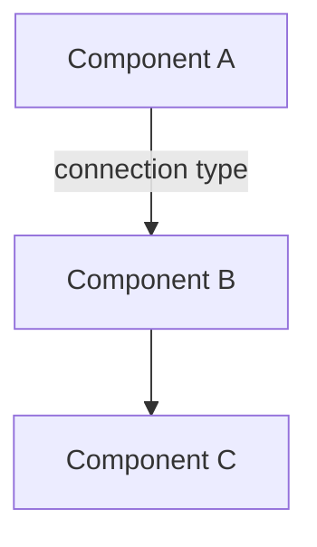

{/*
  CONTRACT: Topic Content Template
  ================================
  This template defines the required structure for all topic MDX files
  per Constitution Pedagogical Standards.

  REQUIRED SECTIONS (in order):
  1. Learning Objectives (3-5 items)
  2. Conceptual Foundation (with physical/biological analogy)
  3. Architecture (Mermaid diagram)
  4. Guided Implementation (code with explanations)
  5. Simulation Exercise (Gazebo/Unity task)
  6. Reflection Questions (2-3 questions)
  7. Further Reading (external links)

  VALIDATION RULES:
  - All code examples MUST have type annotations
  - All code examples MUST use Python 3.10+ syntax
  - All code examples MUST be ROS 2 Humble/Iron compatible
  - Mermaid diagrams MUST have alt text comment above
  - Concept MUST come before code (Principle III)
*/}

# {{TOPIC_TITLE}}

## Learning Objectives

By the end of this topic, you will be able to:

- **Objective 1**: [Measurable outcome using action verb]
- **Objective 2**: [Measurable outcome using action verb]
- **Objective 3**: [Measurable outcome using action verb]
- **Objective 4**: [Optional - Measurable outcome using action verb]

## Conceptual Foundation

{/* START: Physical/Biological Analogy - REQUIRED per Constitution Principle III */}

:::info The Analogy
[Physical or biological analogy explaining WHY this concept matters for robotics]
:::

[Detailed explanation bridging the "Digital Brain" (AI) with the "Physical Body" (Robot)]

{/* END: Conceptual Foundation */}

## Architecture

{/* Alt text: [Description of what the diagram shows for accessibility] */}



**Key Components**:
- **Component A**: [What it does]
- **Component B**: [What it does]
- **Component C**: [What it does]

## Guided Implementation

### Step 1: [First Step Title]

[Explanation of what this step accomplishes]

```python
"""
Module docstring following Google style guide.
"""
from typing import TYPE_CHECKING

if TYPE_CHECKING:
    pass  # Type imports here


def example_function(param: str) -> bool:
    """Function docstring following Google style guide.

    Args:
        param: Description of parameter.

    Returns:
        Description of return value.
    """
    return True
```

### Step 2: [Second Step Title]

[Explanation of what this step accomplishes]

```python
# Code for step 2
```

### Step 3: [Third Step Title]

[Explanation of what this step accomplishes]

```python
# Code for step 3
```

## Simulation Exercise

:::tip Hardware Requirements
This exercise requires [specific hardware/simulation environment].
For Isaac Sim exercises, ensure you have an NVIDIA RTX 4070 Ti or better GPU.
:::

### Exercise Goal

[What students will accomplish in this simulation]

### Instructions

1. [Step-by-step instruction 1]
2. [Step-by-step instruction 2]
3. [Step-by-step instruction 3]

### Expected Outcome

[Description of what students should see when exercise is complete]

## Reflection Questions

1. **Physical AI Connection**: [Question connecting this topic to embodied intelligence principles]

2. **Real-World Application**: [Question about how this applies to actual robotic systems]

3. **Design Tradeoffs**: [Question about architectural decisions and their implications]

## Further Reading

- [ROS 2 Documentation: Relevant Page](https://docs.ros.org/...)
- [Research Paper or Resource](https://...)
- [Hackathon I Syllabus Reference](...)

---

{/*
  PLACEHOLDER: Future Chatbot Integration
  When RAG chatbot is implemented, add chat widget here.
  Integration point: ChatbotWidget component
*/}
