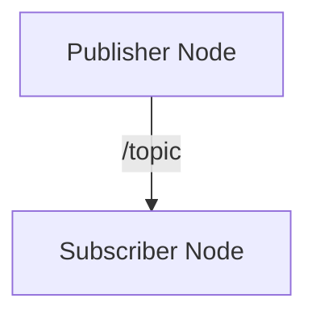
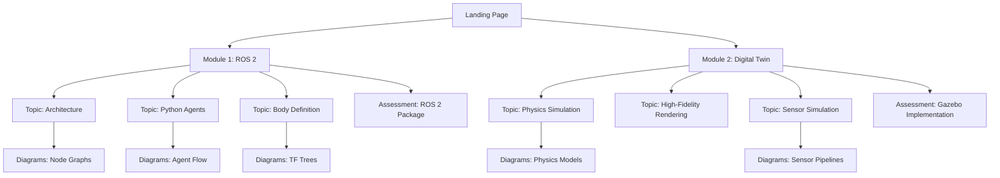

# Data Model: Physical AI & Humanoid Robotics Textbook

**Feature Branch**: `001-physical-ai-textbook`
**Created**: 2025-12-16

## Overview

This textbook is a static documentation site. The "data model" defines the content entities and their relationships, represented as file structures and frontmatter schemas.

---

## Entities

### Module

A major curriculum section containing multiple topics and one assessment.

**File Location**: `book/docs/module-{NN}-{slug}/`

**Directory Structure**:
```
module-01-ros2/
├── _category_.json       # Module metadata for sidebar
├── 01-architecture.mdx   # Topic 1
├── 02-python-agents.mdx  # Topic 2
├── 03-body-definition.mdx# Topic 3
└── 99-assessment.mdx     # Assessment (high sidebar_position to sort last)
```

**_category_.json Schema**:
```json
{
  "label": "Module 1: ROS 2 - The Robotic Nervous System",
  "position": 1,
  "link": {
    "type": "generated-index",
    "description": "Module description for index page"
  }
}
```

**Attributes**:
| Attribute | Type | Required | Description |
|-----------|------|----------|-------------|
| label | string | Yes | Display name in sidebar |
| position | number | Yes | Sort order (Module 1 = 1, Module 2 = 2) |
| description | string | Yes | Brief module overview |

---

### Topic

A learning unit within a module covering a specific concept.

**File Format**: MDX (Markdown + JSX)

**Frontmatter Schema**:
```yaml
---
sidebar_position: 1
title: "ROS 2 Architecture"
description: "Understanding Nodes, Topics, and Services as the robotic nervous system"
keywords: [ros2, nodes, topics, services, dds]
---
```

**Attributes**:
| Attribute | Type | Required | Description |
|-----------|------|----------|-------------|
| sidebar_position | number | Yes | Order within module (1, 2, 3...) |
| title | string | Yes | Topic heading |
| description | string | Yes | SEO meta description |
| keywords | string[] | No | SEO keywords |

**Required Sections** (per constitution Pedagogical Standards):
| Section | Description | Content Type |
|---------|-------------|--------------|
| Learning Objectives | 3-5 measurable outcomes | Bullet list |
| Conceptual Foundation | Physical/biological analogy | Prose |
| Architecture | System visualization | Mermaid diagram |
| Guided Implementation | Step-by-step code | Code blocks + explanations |
| Simulation Exercise | Gazebo/Unity task | Instructions |
| Reflection Questions | 2-3 critical thinking questions | Numbered list |
| Further Reading | External resources | Links |

---

### Assessment

A practical project for validating learning within a module.

**File Format**: MDX

**Frontmatter Schema**:
```yaml
---
sidebar_position: 99
title: "Assessment: ROS 2 Package Development"
description: "Build a complete ROS 2 package demonstrating node communication"
---
```

**Attributes**:
| Attribute | Type | Required | Description |
|-----------|------|----------|-------------|
| sidebar_position | number | Yes | Always 99 (sort to end of module) |
| title | string | Yes | "Assessment: {Project Name}" format |
| description | string | Yes | Project overview |

**Required Sections**:
| Section | Description |
|---------|-------------|
| Project Overview | What students will build |
| Learning Outcomes | What completing this demonstrates |
| Requirements | Specific deliverables |
| Starter Resources | Links to templates, repos |
| Submission Guidelines | How to submit/demonstrate |
| Evaluation Criteria | How work will be assessed |

---

### Diagram

A Mermaid.js visualization embedded in topic content.

**Inline Format**:
````markdown

````

**Types Used** (per constitution):
| Type | Mermaid Syntax | Use Case |
|------|----------------|----------|
| Node Graph | `graph TD/LR` | ROS 2 node/topic/service connections |
| TF Tree | `graph TD` | Coordinate frame relationships |
| State Machine | `stateDiagram-v2` | Robot behavior states |
| Data Flow | `flowchart LR` | Sensor-to-actuator pipelines |
| Sequence | `sequenceDiagram` | Service call interactions |

**Accessibility Requirements**:
- Alt text provided via HTML comment above diagram
- Color-blind friendly palette (avoid red/green only distinctions)
- Fallback text if diagram fails to render

---

### Landing Page

Custom React page for site entry.

**File Location**: `book/src/pages/index.tsx`

**Component Structure**:
```
index.tsx
├── HeroSection
│   ├── Tagline: "The Partnership of People, Agents, and Robots"
│   └── CourseGoal: "Bridging the gap..."
├── HardwareWarning
│   └── RTX 4070 Ti+ requirement notice
├── ModuleCards
│   ├── Module 1 card → /docs/module-01-ros2
│   └── Module 2 card → /docs/module-02-digital-twin
└── FuturePlaceholders (comments for chatbot/personalization)
```

---

## Relationships



---

## File Inventory

Total files to create/modify:

| Category | Count | Files |
|----------|-------|-------|
| Configuration | 3 | docusaurus.config.ts, sidebars.ts, custom.css |
| Landing Page | 2 | index.tsx, index.module.css |
| Module 1 | 5 | _category_.json, 4 MDX files |
| Module 2 | 5 | _category_.json, 4 MDX files |
| Deployment | 1 | .github/workflows/deploy.yml |
| **Total** | **16** | |
