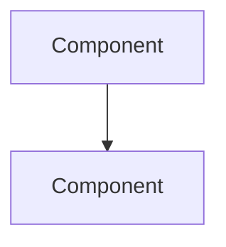

# Research: Physical AI & Humanoid Robotics Textbook

**Feature Branch**: `001-physical-ai-textbook`
**Created**: 2025-12-16

## Summary

This document resolves all technical unknowns identified during the planning phase for the Physical AI textbook implementation.

---

## Research Topics

### 1. Docusaurus Mermaid Integration

**Question**: How to install and configure `@docusaurus/theme-mermaid` in Docusaurus 3.x?

**Decision**: Use `@docusaurus/theme-mermaid` package with markdown configuration.

**Rationale**: Official Docusaurus package with native support for Mermaid diagrams in MDX files. Requires adding to both `themes` array and `markdown.mermaid: true` in config.

**Implementation**:
```bash
cd book && npm install @docusaurus/theme-mermaid
```

**Config Changes** (docusaurus.config.ts):
```typescript
const config: Config = {
  // ... existing config
  markdown: {
    mermaid: true,
  },
  themes: ['@docusaurus/theme-mermaid'],
};
```

**Alternatives Considered**:
- `mermaid` npm package with custom MDX component: Rejected - more complex setup, less integrated
- External diagram service: Rejected - offline capability lost, dependency on third-party

---

### 2. Dark Mode Default Configuration

**Question**: How to set dark mode as the default theme in Docusaurus?

**Decision**: Configure `colorMode` in `themeConfig` with `defaultMode: 'dark'`.

**Rationale**: Docusaurus provides built-in theme toggle with configurable default. Setting `defaultMode: 'dark'` ensures first-time visitors see dark theme.

**Implementation** (docusaurus.config.ts):
```typescript
themeConfig: {
  colorMode: {
    defaultMode: 'dark',
    disableSwitch: false,
    respectPrefersColorScheme: false, // Force dark regardless of system preference
  },
  // ...
}
```

**Alternatives Considered**:
- CSS-only dark mode: Rejected - loses toggle functionality
- System preference only: Rejected - doesn't guarantee dark mode for all users

---

### 3. GitHub Pages Deployment Configuration

**Question**: What configuration is needed for GitHub Pages deployment?

**Decision**: Configure `url`, `baseUrl`, `organizationName`, and `projectName` in config, plus add GitHub Actions workflow.

**Rationale**: Docusaurus has native GitHub Pages support. Configuration enables `docusaurus deploy` command and GitHub Actions CI/CD.

**Implementation** (docusaurus.config.ts):
```typescript
const config: Config = {
  url: 'https://<org>.github.io',
  baseUrl: '/Hackathon-I/',  // Repository name for project pages
  organizationName: '<org>',
  projectName: 'Hackathon-I',
  deploymentBranch: 'gh-pages',
  trailingSlash: false,
  // ...
}
```

**GitHub Actions Workflow** (`.github/workflows/deploy.yml`):
- Triggers on push to main/master
- Builds Docusaurus site
- Deploys to `gh-pages` branch

**Alternatives Considered**:
- Vercel/Netlify: Rejected - spec requires GitHub Pages
- Manual deployment: Rejected - CI/CD automation preferred

---

### 4. MDX File Structure for Educational Content

**Question**: What structure should each topic MDX file follow per constitution requirements?

**Decision**: Use standardized MDX template with required sections per Pedagogical Standards.

**Rationale**: Constitution mandates specific lesson structure (Learning Objectives, Conceptual Foundation, Architecture Diagram, etc.). Consistent structure aids navigation and learning.

**Template Structure**:
```mdx
---
sidebar_position: N
title: "Topic Title"
description: "Brief description for SEO and previews"
---

# Topic Title

## Learning Objectives

By the end of this topic, you will be able to:
- Objective 1 (measurable)
- Objective 2 (measurable)
- Objective 3 (measurable)

## Conceptual Foundation

[Physical/biological analogy explaining the "why"]

## Architecture



## Guided Implementation

[Step-by-step code with explanations]

```python
# Code example with type annotations
```

## Simulation Exercise

[Gazebo/Unity task]

## Reflection Questions

1. Question connecting to Physical AI principles
2. Question about real-world application

## Further Reading

- [Link to ROS 2 documentation]
- [Link to relevant research]
```

**Alternatives Considered**:
- Free-form content: Rejected - constitution requires structure
- Separate components per section: Rejected - over-engineered for static content

---

### 5. Sidebar Auto-Generation

**Question**: How to configure sidebar to auto-generate from folder structure?

**Decision**: Use Docusaurus autogenerated sidebars with custom category labels.

**Rationale**: Reduces maintenance burden. New topics automatically appear in navigation.

**Implementation** (sidebars.ts):
```typescript
const sidebars: SidebarsConfig = {
  tutorialSidebar: [
    {
      type: 'category',
      label: 'Module 1: ROS 2 - The Robotic Nervous System',
      items: [{type: 'autogenerated', dirName: 'module-01-ros2'}],
    },
    {
      type: 'category',
      label: 'Module 2: Digital Twin',
      items: [{type: 'autogenerated', dirName: 'module-02-digital-twin'}],
    },
  ],
};
```

**Alternatives Considered**:
- Manual sidebar definition: Rejected - high maintenance for many topics
- Fully autogenerated: Rejected - loses control over module grouping labels

---

### 6. Python Code Syntax Highlighting

**Question**: Does Docusaurus support Python syntax highlighting with ROS 2 code?

**Decision**: Built-in Prism support for Python. Additional language support via `additionalLanguages`.

**Rationale**: Prism React Renderer included by default. Python is a default language. Add `bash`, `xml` (for URDF), `yaml` for launch files.

**Implementation** (docusaurus.config.ts):
```typescript
themeConfig: {
  prism: {
    theme: prismThemes.github,
    darkTheme: prismThemes.dracula,
    additionalLanguages: ['bash', 'yaml', 'xml'],
  },
}
```

**Alternatives Considered**:
- External syntax highlighter: Rejected - Prism is sufficient and integrated
- No highlighting: Rejected - constitution requires code blocks with highlighting

---

## Resolved Technical Context

All NEEDS CLARIFICATION items have been resolved:

| Item | Resolution |
|------|------------|
| Mermaid setup | @docusaurus/theme-mermaid with markdown config |
| Dark mode default | colorMode.defaultMode: 'dark' |
| GitHub Pages | url/baseUrl/org/project config + Actions workflow |
| MDX structure | Standardized template per Pedagogical Standards |
| Sidebar generation | Autogenerated with custom category labels |
| Syntax highlighting | Prism with additionalLanguages |

---

## Dependencies to Install

```bash
cd book
npm install @docusaurus/theme-mermaid
```

No other new dependencies required - Docusaurus 3.9.2 includes all needed functionality.
