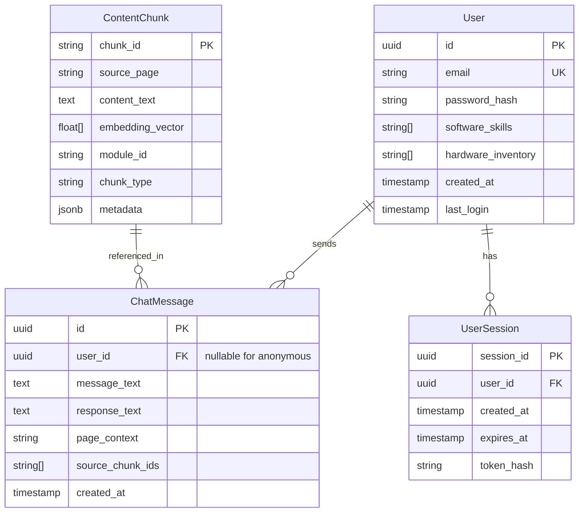

# Data Model: AI-Native Textbook Platform

**Feature**: `002-ai-native-textbook-platform`
**Date**: 2025-12-17

## Entity Relationship Diagram



## Entity Specifications

### User

Represents a registered learner on the platform.

| Field | Type | Constraints | Description |
|-------|------|-------------|-------------|
| id | UUID | PK, auto-generated | Unique identifier |
| email | VARCHAR(255) | UNIQUE, NOT NULL | User's email address |
| password_hash | VARCHAR(255) | NOT NULL | Bcrypt-hashed password |
| software_skills | TEXT[] | DEFAULT '{}' | Array of known languages: Python, C++, JavaScript, None |
| hardware_inventory | TEXT[] | DEFAULT '{}' | Array of owned hardware: Arduino, Jetson, Raspberry Pi, None |
| created_at | TIMESTAMP | DEFAULT NOW() | Account creation time |
| last_login | TIMESTAMP | NULL | Last successful login |

**Validation Rules**:
- Email must be valid RFC 5322 format
- Password minimum 8 characters before hashing
- software_skills values must be from enum: `['Python', 'C++', 'JavaScript', 'None']`
- hardware_inventory values must be from enum: `['Arduino', 'Jetson', 'Raspberry Pi', 'None']`

### UserSession

Represents an authenticated session for a user.

| Field | Type | Constraints | Description |
|-------|------|-------------|-------------|
| session_id | UUID | PK, auto-generated | Unique session identifier |
| user_id | UUID | FK → User.id, NOT NULL | Associated user |
| created_at | TIMESTAMP | DEFAULT NOW() | Session creation time |
| expires_at | TIMESTAMP | NOT NULL | Session expiration (created_at + 7 days) |
| token_hash | VARCHAR(255) | NOT NULL | Hash of session token |

**State Transitions**:
- ACTIVE → EXPIRED (automatic after expires_at)
- ACTIVE → REVOKED (manual logout)

### ChatMessage

Represents a single Q&A exchange in the chat interface.

| Field | Type | Constraints | Description |
|-------|------|-------------|-------------|
| id | UUID | PK, auto-generated | Unique message identifier |
| user_id | UUID | FK → User.id, NULL | NULL for anonymous users |
| message_text | TEXT | NOT NULL | User's question |
| response_text | TEXT | NOT NULL | AI-generated response |
| page_context | VARCHAR(255) | NULL | Current page URL/path when question asked |
| source_chunk_ids | TEXT[] | DEFAULT '{}' | IDs of chunks used for RAG response |
| created_at | TIMESTAMP | DEFAULT NOW() | Message timestamp |

**Validation Rules**:
- message_text max 2000 characters
- response_text max 10000 characters
- page_context must start with `/docs/` or be NULL

### ContentChunk

Represents an indexed portion of textbook content stored in Qdrant.

| Field | Type | Constraints | Description |
|-------|------|-------------|-------------|
| chunk_id | STRING | PK | Format: `{module_id}_{page_slug}_{index}` |
| source_page | STRING | NOT NULL | MDX file path (e.g., `docs/module-01/nodes.mdx`) |
| content_text | TEXT | NOT NULL | The chunked text content |
| embedding_vector | FLOAT[1536] | NOT NULL | OpenAI text-embedding-ada-002 vector |
| module_id | STRING | NOT NULL | `module-01-ros2` or `module-02-digital-twin` |
| chunk_type | STRING | NOT NULL | `concept`, `code`, or `mixed` |
| metadata | JSONB | DEFAULT '{}' | Additional metadata (headings, links) |

**Notes**:
- Stored in Qdrant, not Neon Postgres
- chunk_id is deterministic for idempotent re-ingestion
- embedding_vector dimension matches OpenAI ada-002 model

---

## Database Schema (Neon Postgres)

```sql
-- Users table (extended from Better-Auth default)
CREATE TABLE users (
    id UUID PRIMARY KEY DEFAULT gen_random_uuid(),
    email VARCHAR(255) UNIQUE NOT NULL,
    password_hash VARCHAR(255) NOT NULL,
    software_skills TEXT[] DEFAULT '{}',
    hardware_inventory TEXT[] DEFAULT '{}',
    created_at TIMESTAMP WITH TIME ZONE DEFAULT NOW(),
    last_login TIMESTAMP WITH TIME ZONE
);

-- Sessions table
CREATE TABLE user_sessions (
    session_id UUID PRIMARY KEY DEFAULT gen_random_uuid(),
    user_id UUID NOT NULL REFERENCES users(id) ON DELETE CASCADE,
    created_at TIMESTAMP WITH TIME ZONE DEFAULT NOW(),
    expires_at TIMESTAMP WITH TIME ZONE NOT NULL,
    token_hash VARCHAR(255) NOT NULL
);

-- Chat messages table
CREATE TABLE chat_messages (
    id UUID PRIMARY KEY DEFAULT gen_random_uuid(),
    user_id UUID REFERENCES users(id) ON DELETE SET NULL,
    message_text TEXT NOT NULL,
    response_text TEXT NOT NULL,
    page_context VARCHAR(255),
    source_chunk_ids TEXT[] DEFAULT '{}',
    created_at TIMESTAMP WITH TIME ZONE DEFAULT NOW()
);

-- Indexes
CREATE INDEX idx_users_email ON users(email);
CREATE INDEX idx_sessions_user_id ON user_sessions(user_id);
CREATE INDEX idx_sessions_expires ON user_sessions(expires_at);
CREATE INDEX idx_chat_user_id ON chat_messages(user_id);
CREATE INDEX idx_chat_created ON chat_messages(created_at);
```

---

## Qdrant Collection Schema

```json
{
  "collection_name": "textbook_chunks",
  "vectors": {
    "size": 1536,
    "distance": "Cosine"
  },
  "payload_schema": {
    "chunk_id": "keyword",
    "source_page": "keyword",
    "content_text": "text",
    "module_id": "keyword",
    "chunk_type": "keyword",
    "metadata": "json"
  }
}
```
