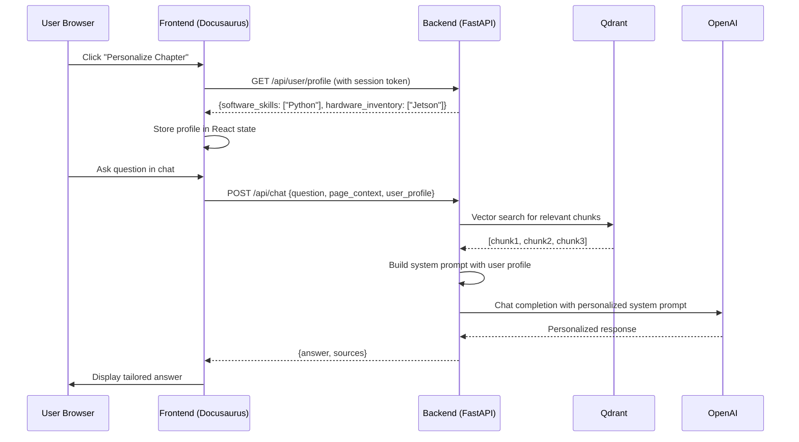
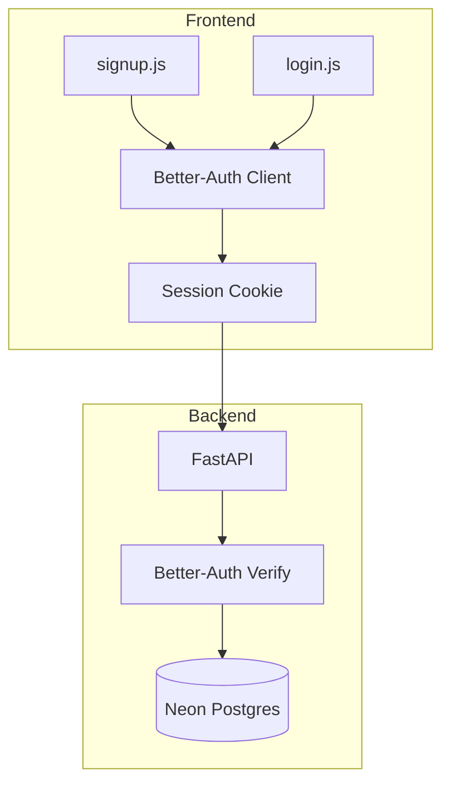

# Research: AI-Native Textbook Platform

**Feature**: `002-ai-native-textbook-platform`
**Date**: 2025-12-17
**Status**: Complete

## 1. Backend Hosting Strategy

### Decision
**Render** (free tier Python web service)

### Rationale
- Native FastAPI support without serverless cold starts
- Auto-deploy from GitHub on push to main
- Free tier includes 750 hours/month (sufficient for this project)
- Built-in HTTPS with custom domain support
- Simple `render.yaml` configuration

### Alternatives Considered
| Option | Pros | Cons | Rejected Because |
|--------|------|------|------------------|
| Vercel | Popular, good DX | 10s timeout on free tier, cold starts | RAG queries may exceed timeout |
| Railway | Docker flexibility | $5 credit limit/month | Credit exhaustion risk |
| Fly.io | 3 free VMs | Requires Dockerfile expertise | Added complexity |

### CORS Strategy
```python
# book/backend/main.py
from fastapi.middleware.cors import CORSMiddleware

origins = [
    "http://localhost:3000",           # Local dev
    "https://<username>.github.io",    # Production (GitHub Pages)
]

app.add_middleware(
    CORSMiddleware,
    allow_origins=origins,
    allow_credentials=True,
    allow_methods=["GET", "POST"],
    allow_headers=["*"],
)
```

### Environment Variable Strategy
Frontend uses build-time injection:
```javascript
// book/src/config.js
export const API_BASE_URL = process.env.REACT_APP_API_URL || 'http://localhost:8000';
```

---

## 2. RAG Ingestion Pipeline

### Decision
**Local seed script** (`book/backend/ingest.py`) with **unified chunking** (code kept inline with context)

### Rationale
- Manual control over when content is re-indexed
- Iterative refinement during development
- Unified chunks preserve code-explanation relationships critical for learning
- Simpler architecture than CI/CD automation for MVP

### Pipeline Architecture


### Chunking Strategy

**Unified Chunks** (code + context together):
- Chunk size: 1000 tokens with 200 token overlap
- Each chunk preserves surrounding context (explanation + code)
- Metadata includes: `source_page`, `module_id`, `chunk_type` (concept/code/mixed)

```python
# book/backend/ingest.py
from langchain.text_splitter import RecursiveCharacterTextSplitter

splitter = RecursiveCharacterTextSplitter(
    chunk_size=1000,
    chunk_overlap=200,
    separators=["\n## ", "\n### ", "\n```", "\n\n", "\n", " "]
)
```

### Why Not Separate Code Chunks?
- ROS 2/robotics code requires surrounding explanation to be meaningful
- "What does this node do?" queries need both code AND concept
- Dual-indexing adds complexity without proportional benefit for educational content

### Ingestion Workflow
1. Developer writes/updates MDX content in `book/docs/`
2. Run: `python book/backend/ingest.py`
3. Script parses all `.mdx` files, chunks, embeds, uploads to Qdrant
4. Verify via Qdrant dashboard or test query

---

## 3. Personalization Data Flow

### Decision
**System prompt injection** - User profile injected into the OpenAI agent's system prompt

### Rationale
- Simplest approach with immediate effect on responses
- No tool-calling overhead
- Profile context persists across the entire conversation
- Easy to A/B test different prompt templates

### Data Flow Trace



### System Prompt Builder

```python
# book/backend/utils/prompt_builder.py
def build_system_prompt(user_profile: dict | None, retrieved_chunks: list[str]) -> str:
    base_prompt = """You are the Professor, an AI tutor for Physical AI and Robotics.
Answer questions ONLY using the provided textbook content.
If the answer is not in the content, say "I can only answer questions about this textbook."
"""

    # Personalization injection
    if user_profile:
        hardware = user_profile.get("hardware_inventory", [])
        software = user_profile.get("software_skills", [])

        if hardware:
            base_prompt += f"\nThe student has experience with: {', '.join(hardware)}."
            base_prompt += "\nWhen relevant, tailor examples to their hardware."

        if software:
            base_prompt += f"\nTheir programming background includes: {', '.join(software)}."
            base_prompt += "\nPrioritize code examples in languages they know."

    # Context injection
    base_prompt += "\n\n## Relevant Textbook Content:\n"
    for i, chunk in enumerate(retrieved_chunks, 1):
        base_prompt += f"\n[Source {i}]\n{chunk}\n"

    return base_prompt
```

### Why Not Tool Parameters?
- Tool parameters require the model to explicitly call the personalization tool
- System prompt injection is "always on" - every response is automatically personalized
- Reduces latency (no extra tool call round-trip)
- Better UX: personalization is seamless, not opt-in per message

---

## 4. Better-Auth Integration

### Decision
Use Better-Auth for both frontend (React client) and backend (Python server validation)

### Architecture



### User Schema Extension

```sql
-- Neon (Postgres) schema extension for Better-Auth
ALTER TABLE users ADD COLUMN software_skills TEXT[] DEFAULT '{}';
ALTER TABLE users ADD COLUMN hardware_inventory TEXT[] DEFAULT '{}';
```

### Signup Form Fields
- Email (required)
- Password (required, min 8 chars)
- Software Background: Multi-select [Python, C++, JavaScript, None/Beginner]
- Hardware Background: Multi-select [Arduino, Jetson, Raspberry Pi, None/Beginner]

---

## 5. Technology Stack Validation

### Constitution Compliance Check

| Requirement | Status | Implementation |
|-------------|--------|----------------|
| Frontend: Docusaurus | ✅ PASS | `book/` root |
| Backend: FastAPI | ✅ PASS | `book/backend/` |
| Auth: Better-Auth | ✅ PASS | Frontend + Backend integration |
| Agent: OpenAI Agents SDK | ✅ PASS | `book/backend/routers/chat.py` |
| Vector DB: Qdrant Cloud | ✅ PASS | Cloud instance for embeddings |
| Database: Neon | ✅ PASS | User profiles + chat logs |
| Deployment: GitHub Pages | ✅ PASS | Frontend static hosting |
| Working Directory: book/ | ✅ PASS | All code within `book/` |

### Dependencies Finalized

**Backend (`book/backend/requirements.txt`)**:
```
fastapi==0.109.0
uvicorn==0.27.0
better-auth==0.3.0
openai==1.12.0
qdrant-client==1.7.0
python-dotenv==1.0.0
asyncpg==0.29.0
pydantic==2.5.0
```

**Frontend (`book/package.json` additions)**:
```json
{
  "dependencies": {
    "better-auth": "^0.3.0",
    "axios": "^1.6.0",
    "@docusaurus/theme-mermaid": "^3.0.0"
  }
}
```

---

## Summary of Resolved Unknowns

| Unknown | Resolution |
|---------|------------|
| Backend hosting | Render (free tier) |
| CORS strategy | Allow GitHub Pages origin + localhost |
| API_BASE_URL | Environment variable with build-time injection |
| RAG ingestion | Local `ingest.py` script, run manually |
| Chunking strategy | Unified (code + context together), 1000 tokens |
| Personalization injection | System prompt injection (not tool params) |
| User profile flow | Frontend fetches profile, sends with chat requests |
| Auth integration | Better-Auth client (frontend) + server validation (backend) |
